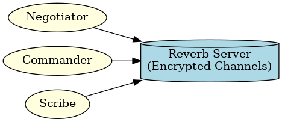
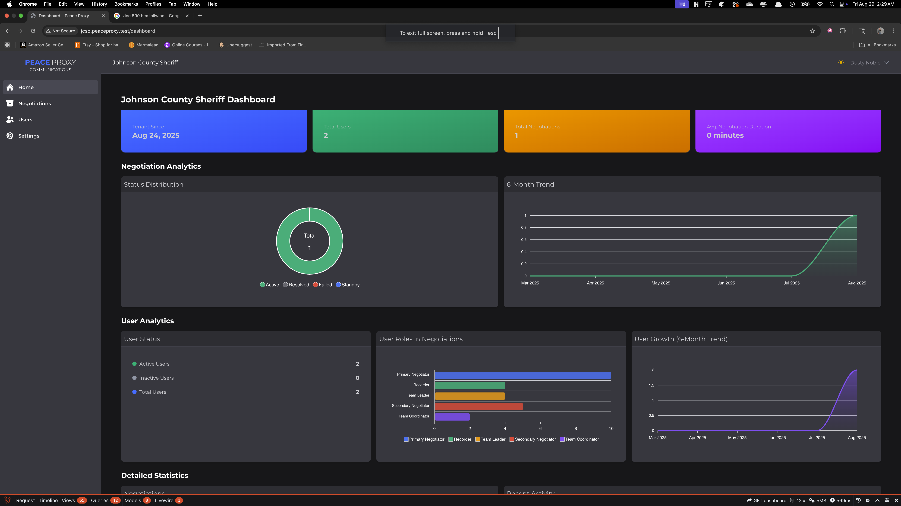

[//]: # (
)

[//]: # (  )

[//]: # (
)

# Overview

## Introduction

Welcome to PeaceProxy, a comprehensive crisis negotiation and incident management platform designed specifically for law
enforcement agencies. This powerful tool helps negotiators, command staff, and crisis teams manage high-stakes
situations with greater efficiency, coordination, and documentation.

PeaceProxy provides a secure, real-time environment for tracking negotiations, managing demands, coordinating team
efforts, and generating professional reports that support both operational success and post-incident review.

This user guide will help you understand the platform's capabilities and how to leverage them effectively during crisis
situations.

## Who PeaceProxy Serves

PeaceProxy is designed for multiple roles within law enforcement agencies:

- **🔹 Crisis Negotiation Teams** – Streamline communication, document demands, and coordinate responses in real time
- **🔹 Command Staff** – Gain situational awareness through live updates and structured reports
- **🔹 Crisis Intervention Specialists** – Access tools to better understand subjects and manage outcomes
- **🔹 Post-Incident Review Boards** – Receive detailed documentation for training, compliance, and legal proceedings

## Key Features and Capabilities

### 📱 Real-Time Negotiation Support

PeaceProxy provides robust communication tools to keep your team connected during critical incidents:

- **Secure Chat System**: End-to-end encrypted communication between negotiators and command staff
- **Flexible Messaging Channels**: Private, group, and broadcast messaging options
- **Message Management**: Send messages, react, attach files, and filter conversations by subject, status, or tag
- **Presence Tracking**: See who's online, active, and engaged in the incident

### 📋 Incident & Demand Tracking

Track all aspects of an incident with precision:

- **Subject & Incident Logging**: Record comprehensive details about subjects, hostages, and incident parameters
- **Demand Management**: Track and update demands as they evolve throughout the negotiation
- **Timestamped Records**: Create courtroom-ready records with precise timing of all events
- **Structured Workflow**: Follow incidents through their complete lifecycle from initial logging to resolution and
  reporting

### 📊 Comprehensive Reporting

PeaceProxy generates detailed reports that serve multiple purposes:

- **Negotiation Summary**: Overview of the entire negotiation process
- **Demand Tracking**: Documentation of all demands, their status, and resolution
- **Communication Analysis**: Insights into communication patterns and effectiveness
- **Negotiator Performance**: Assessment of negotiation techniques and outcomes
- **Incident Logs**: Chronological record of all incident-related events
- **Psychological Profiling**: Documentation of subject behavior and psychological assessments
- **Team Coordination**: Analysis of team communication and coordination
- **Outcome Analysis**: Evaluation of incident resolution and outcomes
- **Post-Incident Debrief**: Structured format for team debriefing
- **Legal & Compliance Documentation**: Records formatted for legal proceedings

Each report offers filtering capabilities and can be exported in PDF or CSV formats for easy sharing and archiving.

### 👥 Team Coordination

Enhance team effectiveness with specialized coordination tools:

- **Role-Based Permissions**: Specific access levels for negotiators, commanders, scribes, and analysts
- **Task Assignment**: Delegate responsibilities and track completion
- **Accountability Features**: Ensure all team members fulfill their assigned roles

### 🛠️ Advanced Tools

PeaceProxy includes specialized features to enhance operational capabilities:

- **Barcode Signature Retrieval**: Scan a code to securely apply stored signatures to official documents
- **Subject Image & File Management**: Upload, store, and restrict access to sensitive files
- **Multi-Tenant Architecture**: Each agency operates in its own secure, isolated environment

## 🛡️ Security Features

PeaceProxy prioritizes the security of sensitive information:

- **End-to-End Encryption**: Protects all communications from unauthorized access
- **Role & Permission Controls**: Ensures information is only accessible to authorized personnel
- **Audit Logs**: Maintains records of all system activities for accountability
- **Secure Cloud Storage**: Provides restricted access to documents and media

## How to Use PeaceProxy

### Before an Incident

- Familiarize yourself with the platform's features through training and simulations
- Prepare templates and protocols for different incident types
- Ensure all team members understand their roles and access levels

### During an Incident

- Use real-time chat for team communication
- Track demands and subject information as the situation evolves
- Provide command staff with live updates through the platform
- Document all aspects of the negotiation process

### After an Incident

- Generate comprehensive reports for debriefing
- Export documentation for legal proceedings
- Review incident data for training purposes
- Analyze outcomes to improve future responses

## Benefits for Your Agency

- **Improved Coordination**: Keep all team members aligned during critical incidents
- **Reduced Risk**: Prevent misunderstandings with accurate, real-time information
- **Operational Efficiency**: Streamline communication and documentation processes
- **Training Resources**: Convert past incidents into structured learning opportunities
- **Legal Protection**: Maintain precise records of all decisions and actions

## Accessing PeaceProxy

PeaceProxy is accessible from multiple devices to accommodate various operational needs:

- **Desktop and Laptop Browsers**: Optimized for command posts and operations centers
- **Mobile Devices**: Designed for negotiators and team members in the field

## Getting Started with PeaceProxy

To begin using PeaceProxy:

1. **Access Your Agency's Portal**: Navigate to your agency's unique subdomain (e.g., `youragency.peaceproxy.com`)
2. **Log In**: Enter your credentials provided by your administrator
3. **Set Up Your Profile**: Complete your profile information and preferences
4. **Explore the Dashboard**: Familiarize yourself with the main interface components
5. **Join a Training Session**: Participate in a simulation to practice using the platform

Your agency administrator will provide specific login details and initial training. For technical issues or questions,
contact your designated support representative.

## Detailed Documentation

For more detailed information about specific features, refer to these sections of the user guide:

[//]: # (- [Conversations Guide]&#40;conversations.md&#41; - Detailed instructions for using the chat and messaging features)

[//]: # (- [Reports Guide]&#40;reports.md&#41; - Complete information about generating and exporting reports)

[//]: # (- [Security Best Practices]&#40;../security.md&#41; - Guidelines for maintaining secure operations)

---

**Note**: This overview provides a high-level introduction to PeaceProxy. For detailed instructions on specific
features, please refer to the relevant sections of this user guide.

